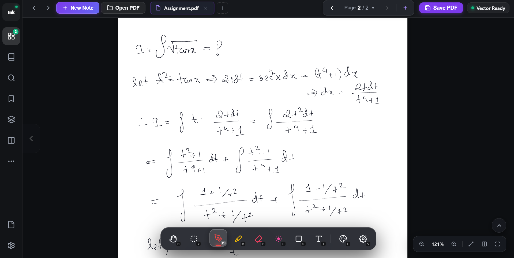

# Inkwell — PDF-Native Vector Ink Annotator

<div align="center">



[](https://www.rust-lang.org/)
[](https://tauri.app/)
[](https://pdfium.googlesource.com/pdfium/)
[](LICENSE)
[](#)

<p align="center">
  <strong>A high-performance, ultra-low latency digital handwriting workstation and PDF annotator engineered for tablet digitizers and high-refresh touchscreens.</strong>
</p>

</div>

---

## Overview

**Inkwell** combines zero-latency stroke response with standard vector PDF interoperability. Unlike conventional note-taking applications that rasterize underlays into lossy bitmaps or lock annotations into proprietary sidecar databases, Inkwell renders PDFs on-demand using vector level-of-detail (LOD) tile caching and writes annotations directly into the standard ISO 32000 PDF document structure as vector cubic Bézier ribbons.

Every stroke drawn in Inkwell is saved as native vector geometry—crisp at any magnification level and 100% interoperable with Adobe Acrobat, Apple Books, Google Chrome, and Microsoft Edge.

---

## ✨ Core Highlights

### 🖋️ Ultra-Low Latency Inking Engine
- **Dual-Canvas Wet/Dry Pipeline**: Dedicated wet layer for instantaneous stylus sampling (up to 240Hz+ via `pointerrawupdate` / CDP) and dry vector layer for committed geometry.
- **Sub-Pixel Analogue Pressure**: 10-bit pressure curve resolution with customizable gamma response, dynamic taper, and One-Euro noise filtering.
- **Cubic Bézier Ribbon Outlines**: Generates smooth vector ribbon boundaries with true $C^1$ continuity, completely eliminating angular faceting at high zoom.
- **Chisel-Tip Rectangular Highlighter**: Authentic calligraphic chisel marker geometry with flat horizontal bounds, clean vertical end caps, and multiply color blending.
- **Geometric Shapes Tool**: Precise linear sampling preserves crisp 90° rectangle corners, circles, and ruler guidelines without curve distortion.
- **Precision Multi-Page Eraser**: Continuous coordinate proximity hit-testing across all visible pages with live visual cursor feedback.
- **Laser Pointer**: Ephemeral glowing pointer with live trailing decay for presentations and teaching.

### 📄 First-Class PDF & Whiteboard Support
- **Continuous Multi-Page Layout**: Seamless vertical document scrolling with 24pt inter-page spacing, visible frustum tile rendering, and vector paper drop shadows.
- **Interactive Right Scrollbar**: Draggable floating document scrollbar with real-time thumb tracking, position tooltip (`Page X / Y`), and track click-to-scroll.
- **Hierarchical Table of Contents (TOC)**: PDFium recursive outline extraction parsing multi-level bookmark trees with destination page mappings and collapsible tree navigation.
- **Image Pasting & Native PDF Embedding**: Paste screenshots and images directly from clipboard (`Ctrl+V`) onto the active page with interactive repositioning, 8-handle resizing, and native PDF image object embedding (`PdfPageImageObject`) on save.
- **Blank Whiteboard Mode**: Start fresh notes and infinite whiteboards (`Ctrl+N`) backed by native 100% valid PDF documents with instant vector saving.
- **On-Demand Vector Tile Rasterizer**: Powered by Google's PDFium engine for high-resolution LOD tile rendering with LRU cache eviction.
- **Append-Only Incremental Save**: Original document bytes are never overwritten or corrupted in-place. All annotations append cleanly to the PDF xref table.
- **WAL Journal Crash Durability**: System temp-dir Write-Ahead Logging (`inkwell-wal`) records every stroke with immediate `fsync`, effortlessly recovering unsaved work after unexpected power loss or crashes.
- **Interactive Sticky Notes**: Place editable keyboard text notes anywhere on the document canvas (`T`).

### 🎛️ Unified Selection, Transform & Modern Workspace
- **Unified Freeform Lasso & Move Tool**: Draw a freeform polygon loop or click directly on strokes/images to select, drag to reposition with live wet-canvas feedback, and resize using 8 transform handles.
- **Full Clipboard & Object Editing**: Cut (`Ctrl+X`), Copy (`Ctrl+C`), Paste (`Ctrl+V`), Duplicate (`Ctrl+D`), and Select All on current page (`Ctrl+A`) with full Undo/Redo history.
- **Context Menu & Action Bar**: Right-click floating radial wheel and selection action bar for quick edits.
- **Dual-Pane Split View**: Work side-by-side on two separate document pages simultaneously with stabilized DOM dividers and independent pan/zoom controls.
- **Live Page Thumbnails**: Real-time asynchronous tile rendering in the thumbnail drawer with scaled vector stroke overlays.
- **Document Metadata Dashboard**: Real-time stats grid (page count, vector stroke counter, dimensions), hardware pointer diagnostics, and crash journal health indicators.

---

## 🏛️ Architecture & Subsystem Map

```
InkWell/
├── inkwell/                      # Core Rust Workspace
│   ├── crates/inkwell-core/      # Document model, vector geometry (Cubic Bézier ribbons, RDP), WAL engine
│   ├── crates/inkwell-pdf/       # PDFium bindings, outline extraction, image embedding, LOD tile rasterizer, PDF parser & xref normaliser
│   └── crates/inkwell-wal/       # Append-only Write-Ahead Log journal with crash recovery
├── inkwell-app/                  # Desktop Application Host (Tauri v2)
│   ├── src-tauri/                # IPC commands (open, save, get outline, insert page, whiteboard), window capabilities
│   └── src/                      # Web frontend (HTML5 canvas, Vanilla CSS glassmorphism, ESNext engine)
│       ├── js/app.js             # Main application controller, selection engine, UI bindings, and multi-tab manager
│       ├── js/ink.js             # Dual-canvas wet/dry engine, chisel ribbons, One-Euro filter
│       └── js/viewport.js        # Multi-page continuous coordinate layout, split-pane viewport, zoom/pan transforms
├── inkwell-m0/                   # Playwright smoke test harness & synthetic CDP pen simulation
└── tools/                        # Multi-engine PDF standards validation scripts (Poppler, MuPDF, PyPDF)
```

---

## ⌨️ Keyboard & Stylus Shortcuts

| Tool / Action | Shortcut | Description |
|---|---|---|
| **Fountain Pen** | `P` | Pressure-sensitive analogue vector pen |
| **Highlighter** | `M` | Chisel-tip translucent rectangular highlighter (Yellow preset) |
| **Precision Eraser** | `E` | Proximity stroke eraser across visible continuous pages |
| **Lasso / Move Tool** | `V` | Freeform polygon loop & click-to-select, drag-to-move, 8-handle resize |
| **Laser Pointer** | `L` | Ephemeral glowing presentation pointer |
| **Shape Tool** | `U` | Cycles Rectangle, Ellipse, and Ruler Line |
| **Text Note** | `T` | Interactive floating keyboard sticky note |
| **Pan / Hand Tool** | `H` / `Space` | Pan canvas viewport without drawing |
| **Radial Quick Menu** | `Right Click` / Barrel | Stylus 6-slot floating quick action wheel |
| **Select All (Current Page)** | `Ctrl` + `A` | Select all strokes and images on the active visible page |
| **Copy Selection** | `Ctrl` + `C` | Copy selected strokes and images to clipboard |
| **Cut Selection** | `Ctrl` + `X` | Cut selected strokes and images |
| **Paste Object / Image** | `Ctrl` + `V` | Paste copied objects or clipboard screenshot images |
| **Duplicate Selection** | `Ctrl` + `D` | Duplicate selected objects with offset |
| **Delete Selection** | `Delete` / `Backspace` | Delete currently selected objects |
| **New Whiteboard** | `Ctrl` + `N` | Create a fresh blank whiteboard PDF |
| **Open PDF Document** | `Ctrl` + `O` | Open an existing PDF via file picker |
| **Save Document** | `Ctrl` + `S` | Incrementally save ink layers & images or Save As |
| **Command Palette** | `Ctrl` + `K` / `Ctrl` + `Shift` + `P` | Global quick search and command launcher |
| **Toggle Split View** | `Ctrl` + `\` | Toggle dual-pane side-by-side reading mode |
| **Toggle Sidebar** | `Ctrl` + `B` | Open/close navigation drawer |
| **Page Thumbnails** | `Ctrl` + `G` | Open page thumbnail drawer |
| **Document Search** | `Ctrl` + `F` | Search document text |
| **Undo / Redo** | `Ctrl` + `Z` / `Ctrl` + `Y` | Undo or redo committed actions |
| **Fullscreen Mode** | `F11` | Toggle distraction-free full-screen stage |

---

## 🚀 Quick Start

### Prerequisites
1. **Rust Toolchain**: `rustc` and `cargo` (1.75+)
2. **Node.js**: `node` (v18+) and `npm`
3. **PDFium**: `pdfium.dll` (included in repo or discoverable on PATH)

### Running on Windows
```powershell
# Double click or run the desktop launcher:
.\Launch Inkwell.bat

# Or build and launch directly via Cargo:
cd inkwell-app/src-tauri
cargo run
```

---

## 🧪 Verification & Test Suite

Inkwell enforces strict PDF standards compliance, zero synthetic delays, and 100% test coverage:

```powershell
# 1. Run all Rust Core, Geometry, WAL, Outline, and PDFium tests (48 tests)
cd inkwell
cargo test --workspace -- --test-threads=1

# 2. Run Playwright Synthetic Pen & Input Pipeline Smoke Tests (18/18 checks)
cd inkwell-m0
py -3 test_smoke.py

# 3. Check for zero Clippy lints
cd inkwell
cargo clippy --all-targets
```

---

## 📄 License

Dual-licensed under the [MIT License](LICENSE-MIT) or [Apache 2.0 License](LICENSE-APACHE) at your option.
