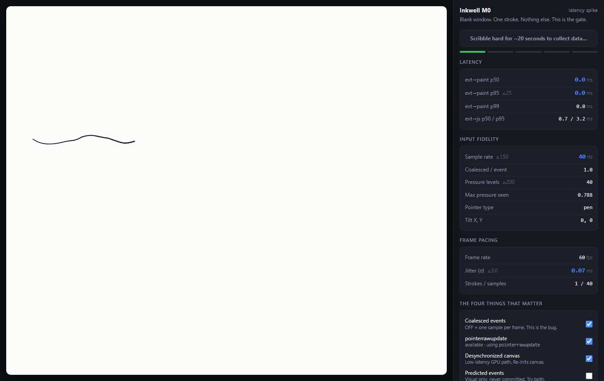

# Inkwell — PDF-Native Vector Ink Annotator



> [!CAUTION]
> **WORK IN PROGRESS**: Inkwell is currently an early-stage experimental prototype under active development. Many core functionalities—including full PDF background page rasterization and real-time stroke curve smoothing algorithms—are still actively being worked on and are not yet fully implemented or finalized. Features, UI behaviors, and internal APIs remain subject to rapid change.

**Inkwell** is a high-performance, low-latency digital handwriting and PDF annotation desktop application engineered for tablet digitizers (e.g. Wacom, Huion, Microsoft Surface, iPad Pencil). Built with **Rust**, **PDFium**, and **Tauri v2**, Inkwell combines zero-latency stroke response with full vector PDF standard `/Ink` interop.

---

## Key Features

### 🖋️ Hardware-Accelerated Vector Ink Engine
- **Low-Latency Dual-Canvas Architecture**: Separate wet (active stroke) and dry (committed vector ink) layers running at native digitizer polling rates (up to 233Hz).
- **Sub-Pixel Pressure Sensing**: 10-bit analogue pressure resolution with customizable stroke width taper, gamma curves, and One-Euro noise filtering.
- **Vector Ribbon Outlines**: Renders smooth stroke outlines with true $C^1$ continuity, avoiding faceting at high zoom levels.

### 📄 Native PDF Integration
- **PDFium High-Resolution Rasterizer**: High-fidelity vector tile rendering for complex PDFs, textbooks, and multi-page documents.
- **Standards-Compliant `/Ink` Annotations**: Native Adobe Acrobat & PDF-spec `/Ink` object structure with embedded sidecars (`/Inkw_Doc`) and `/InkList` centrelines.
- **WAL Crash Safety**: Write-Ahead Logging (WAL) records every stroke instantly, recovering state seamlessly after ungraceful shutdowns.

### 🎨 Modern Workspace & UI
- **3-Column Professional Layout**: Pinned left navigation rail (`#navRail`), collapsible secondary drawer (`#navDrawer`), and main viewport stage (`#stage`).
- **Top Header Bar & PDF Toolbar**: Multi-tab document bar (`#tabBar`), primary "Open PDF" header button (`#btnHeaderOpen`), zoom controls, page selector pill, and export/share trigger.
- **Canvas Welcome Dropzone**: Glassmorphic empty-state CTA overlay (`#welcomeDropzone`) with file drop support.
- **Glassmorphic Inking Dock**: Context-aware floating bar (`#floatingDock`) with pen, highlighter, eraser, shapes, and lasso tools.
- **Radial Menu**: 6-slot quick action radial menu accessible via right-click or stylus barrel button.
- **Lasso Select & Editing**: Vector stroke selection bounding box with control handles, hotkey deletion (`Delete`/`Backspace`), and full `Ctrl+Z` Undo/Redo.
- **Command Palette & Dual Pane**: Quick command execution modal (`Ctrl+Shift+P`), dual-pane split view, and blank page insertion.

---

## Technology Stack

- **Core Engine**: Rust (`inkwell-core`, `inkwell-pdf`, `inkwell-wal`)
- **Desktop Shell**: Tauri 2.0 (Windows / macOS / Linux)
- **PDF Rendering**: PDFium (`pdfium-render` bindings)
- **Frontend Layer**: HTML5 Canvas, Vanilla CSS, JavaScript ESNext
- **Testing & QA**: PyMuPDF, Poppler, PyPDF, Playwright CDP CDP Synthetic Pen testing

---

## Project Structure

```
InkWell/
├── inkwell/                      # Core Rust crates
│   ├── crates/inkwell-core/      # Document model, vector stroke geometry, RDP simplification
│   ├── crates/inkwell-pdf/       # PDFium tile rasterization & PDF structure manipulation
│   └── crates/inkwell-wal/       # Binary Write-Ahead Log engine
├── inkwell-app/                  # Tauri 2.0 Desktop Application
│   ├── src-tauri/                # Tauri backend IPC commands & Rust main app
│   └── src/                      # Canvas frontend, UI styling, and ink rendering
├── inkwell-m0/                   # Playwright smoke test harness & synthetic pen capture
├── tools/                        # Validation scripts (validate.py, PDF spec checks)
└── Launch Inkwell.bat            # Desktop launcher script for Windows
```

---

## Quick Start

### Prerequisites
1. **Rust Toolchain**: `rustc` and `cargo` (1.75+)
2. **Node.js**: `node` (v18+) and `npm`
3. **PDFium**: `pdfium.dll` (bundled or placed in executable directory)

### Running Locally
To launch the application directly:
```bash
# Using the Windows batch launcher:
.\Launch Inkwell.bat

# Or building via Cargo/Tauri CLI:
cd inkwell-app/src-tauri
cargo build
```

---

## Testing & Quality Assurance

Inkwell features a comprehensive verification suite spanning unit tests, PDF standards compliance, and synthetic pen input simulation:

```bash
# 1. Run core Rust unit and integration tests (46 tests)
cd inkwell
cargo test --workspace

# 2. Run PDFium live tile rendering tests
cargo test --package inkwell-pdf

# 3. Run cross-language PDF standards validator (PyPDF, Poppler, MuPDF)
py -3 tools/validate.py

# 4. Run synthetic pen CDP input smoke test
cd ../inkwell-m0
py -3 test_smoke.py
```

---

## Keyboard & Stylus Shortcuts

| Action | Shortcut |
|---|---|
| **Pen Tool** | `P` |
| **Highlighter** | `H` |
| **Eraser (Spring-Loaded)** | Hold `E` |
| **Laser Pointer (Spring-Loaded)** | Hold `L` |
| **Lasso Select** | `V` |
| **Ruler / Rectangle / Ellipse** | `R` / `Q` / `O` |
| **Command Palette** | `Ctrl` + `Shift` + `P` |
| **Radial Quick Menu** | Stylus Barrel Button / Right Click |
| **Undo / Redo** | `Ctrl` + `Z` / `Ctrl` + `Y` |
| **Save Document** | `Ctrl` + `S` |

---

## License

Dual-licensed under MIT / Apache 2.0. See [LICENSE](LICENSE) for details.
