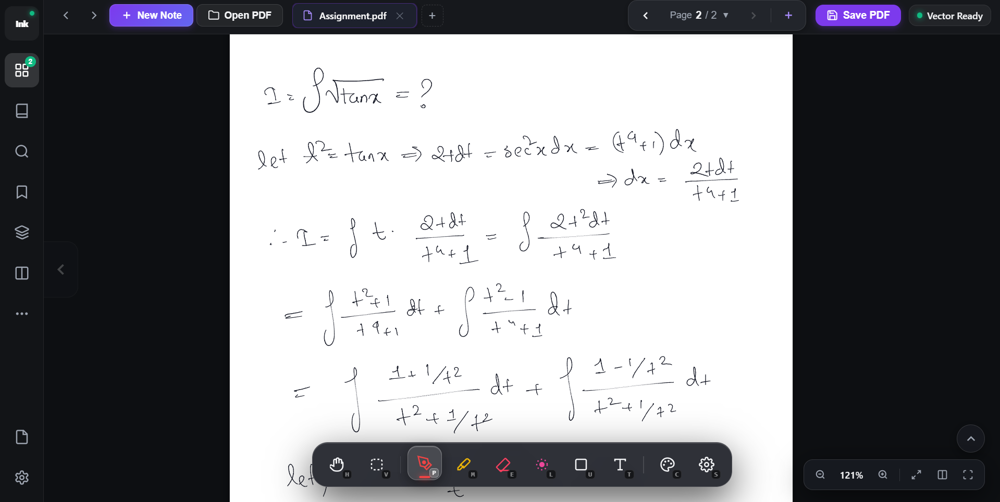

# Inkwell — PDF-First Digital Notebook & Vector Annotator

<div align="center">



[](https://www.rust-lang.org/)
[](https://tauri.app/)
[](https://pdfium.googlesource.com/pdfium/)
[](LICENSE)
[](#)

<p align="center">
  <strong>A high-performance, ultra-low latency digital handwriting notebook and PDF annotator built on the "File over App" philosophy. Engineered for tablet digitizers and high-refresh touchscreens.</strong>
</p>

</div>

---

## 💡 The Philosophy: "File Over App"

Modern note-taking software suffers from a fundamental flaw: **vendor lock-in and container fragility**. 
- Traditional note apps trap your handwritten notes inside proprietary databases, closed cloud silos, or application-specific sidecar files (`.xopp`, `.rnote`, `.one`) that reference PDFs by local file paths—breaking when files are moved, renamed, or synced.
- Other tools rasterize vector PDFs into lossy, low-resolution bitmaps upon import, destroying text sharpness when you zoom in.
- Mainstream PDF annotators frequently paywall basic pressure sensitivity, stroke smoothing, and tablet ergonomics.

Inkwell is built on the **"File over App"** philosophy articulated by Steph Ango (*Kepano*, CEO of Obsidian): **your files belong to you, and the format must outlive the software.**

> ### The Inkwell Contract
> 1. **The single source of truth is always a valid, standard PDF (ISO 32000).** No proprietary formats or binary database silos.
> 2. **Never rasterize at import.** Vector documents remain 100% vector, rendered on demand per zoom level.
> 3. **Universal interoperability.** Ink layers are saved as native vector geometry. Notes created in Inkwell open crisply in Adobe Acrobat, Apple Books, Google Chrome, Microsoft Edge, and mobile PDF readers.
> 4. **Frictionless local-first sync.** Store your documents directly in Google Drive, OneDrive, Nextcloud, or Syncthing. No forced proprietary cloud accounts, no sync subscriptions.

---

## 🏛️ The Three-Layer PDF Architecture

To achieve universal compatibility without sacrificing lossless digital editing, Inkwell writes three distinct layers simultaneously into every saved PDF:

```
┌────────────────────────────────────────────────────────────────────────┐
│                        STANDARD ISO 32000 PDF                          │
├────────────────────────────────────────────────────────────────────────┤
│ Layer 1: Visual (Universal)                                            │
│   • Variable-width pressure strokes saved as filled vector ribbon      │
│     outlines (Bézier curves + non-zero winding 'f' operator).          │
│   • Crisp at 6400% zoom; zero pixelation; prints natively everywhere.  │
├────────────────────────────────────────────────────────────────────────┤
│ Layer 2: Semantic (Interoperability)                                   │
│   • Registered as standard PDF /Annot objects (/Subtype /Ink).        │
│   • Carries /AP appearance streams and centreline coordinates.         │
│   • Recognised and deletable in Acrobat, Okular, and Xodo.             │
├────────────────────────────────────────────────────────────────────────┤
│ Layer 3: Private Sidecar (Lossless Re-editing)                         │
│   • Raw high-frequency sample stream (x, y, pressure, timestamps).     │
│   • Varint-delta compressed and embedded inside an /EmbeddedFiles      │
│     stream under private /Inkw_* catalog keys.                         │
│   • Enables lossless stroke re-editing and manipulation in Inkwell.    │
└────────────────────────────────────────────────────────────────────────┘
```

---

## ✨ Core Highlights & Capabilities

### 🖋️ Ultra-Low Latency Inking Engine
- **Dual-Canvas Wet/Dry Pipeline:** Instantaneous stylus feedback rendered on an isolated "wet" canvas without triggering DOM reflows or full-scene redraws, baked into the vector "dry" canvas upon pen lift.
- **Sub-Pixel Analogue Pressure:** High-density sampling with exponential moving average (EMA) pressure curves, user-configurable gamma response, and One-Euro temporal filtering to suppress jitter while tracking rapid handwriting.
- **$C^1$ Continuous Bézier Ribbons:** Centripetal Catmull-Rom splines generate smooth cubic Bézier ribbon outlines, eliminating the faceted, polygonal appearance of naive digital pens at high magnifications.
- **Chisel-Tip Highlighter:** Authentic calligraphic chisel marker geometry with flat horizontal bounds, vertical end caps, and true PDF `/Multiply` blend modes.
- **Precision Spatial Eraser:** Continuous AABB coordinate proximity hit-testing across all visible pages with live visual feedback.
- **Laser Pointer:** Ephemeral glowing presentation pointer with live decay for teaching, lecturing, and screen-shares.

### 📄 First-Class PDF & Notebook Workspace
- **Continuous Multi-Page Layout:** Seamless vertical document scrolling with 24pt inter-page spacing and vector paper drop shadows.
- **On-Demand Vector Tile Rasterizer:** Powered by Google's PDFium engine for high-resolution level-of-detail (LOD) tile rendering with LRU cache eviction—text remains razor-sharp at any zoom level.
- **New Digital Notebooks (`Ctrl+N`):** Instant creation of clean, vector-native digital notebooks with paper templates (blank, lined, grid).
- **Dual-Pane Split View (`Ctrl+\`):** Side-by-side study workspace—read a textbook or lecture slides in the left pane while taking handwritten notes on the right, each with independent pan and zoom.
- **Append-Only Incremental Save:** Inkwell preserves the original PDF bytes, appending updated xref tables and objects so base documents are never corrupted in-place.
- **Temp-Dir WAL Crash Durability:** System temporary directory Write-Ahead Logging (`inkwell-wal`) commits every stroke with immediate `fsync`, effortlessly recovering unsaved work after crashes without thrashing cloud sync folders.
- **Hierarchical Table of Contents & Bookmarks:** Recursive PDF outline extraction with collapsible tree navigation and direct page jumps.
- **High-Precision PDF Text Selection (`S`):** Character-level bounding box resolution, persistent visual highlights, and instant clipboard copy.

### 🎛️ Unified Selection, Transform & Toolsuite
- **Freeform Lasso & Move Tool (`V`):** Draw a freeform selection loop or click directly on objects, drag with live wet-canvas feedback, and resize using 8-handle bounding boxes.
- **Clipboard & Object History:** Cut (`Ctrl+X`), Copy (`Ctrl+C`), Paste (`Ctrl+V`), Duplicate (`Ctrl+D`), and Select All on active page (`Ctrl+A`) with full multi-level Undo/Redo.
- **Image Pasting & Embedding:** Paste screenshots directly from the clipboard (`Ctrl+V`), resize/reposition interactively, and embed natively as PDF image objects.
- **Interactive Sticky Notes (`T`):** Place editable text notes anywhere on the document canvas, embedded as real PDF text objects on save.
- **Geometric Shapes (`R`, `O`, `L`):** Vector rectangles, ellipses, and straight ruler lines with live preview overlays.
- **Radial Quick Menu (`Right-Click` / Barrel Button):** Stylus-friendly 6-slot floating quick action wheel for distraction-free tool switching.
- **Command Palette (`Ctrl+K` / `Ctrl+Shift+P`):** Global command search and keyboard launcher.

---

## 📥 Downloads & Releases

Pre-compiled standalone packages and installers are available directly on the **[GitHub Releases](https://github.com/nabilbinsayed/InkrementalNotes/releases)** page.

| Platform | Package / Format | Instructions |
|---|---|---|
| **Windows** | **Installer (`.exe` / `.msi`)** | Run `Inkwell_<version>_x64-setup.exe` (or `.msi`) for desktop integration. |
| **Windows** | **Portable (`.zip`)** | Extract `inkwell-windows-x64-portable.zip` and run `Launch Inkwell.bat`. Zero installation required. |
| **Linux (Universal)** | **AppImage (`.AppImage`)** | Download `Inkwell_<version>_amd64.AppImage`, run `chmod +x`, and launch. Compatible with Ubuntu, Fedora, Arch, openSUSE. |
| **Linux (Ubuntu / Debian)** | **Debian Package (`.deb`)** | Install via `sudo dpkg -i inkwell_*.deb`. |
| **Linux (Fedora / RHEL)** | **RPM Package (`.rpm`)** | Install via `sudo dnf install ./inkwell-*.rpm`. |
| **Linux (Portable)** | **Tarball (`.tar.gz`)** | Extract `inkwell-linux-x64-portable.tar.gz` and execute `./Launch Inkwell.sh`. |

> [!TIP]
> All pre-compiled releases include bundled PDFium dynamic libraries and cryptographic checksums (`SHA256SUMS.txt`).

---

## 🏛️ Architecture & Subsystem Map

```
InkWell/
├── inkwell/                      # Core Rust Workspace
│   ├── crates/inkwell-core/      # Document model, vector geometry (Cubic Bézier ribbons, RDP), WAL engine, spatial index
│   ├── crates/inkwell-pdf/       # PDFium bindings, outline extraction, LOD tile rasterizer, PDF parser & xref normaliser
│   └── crates/inkwell-wal/       # Append-only Write-Ahead Log journal with crash recovery & FNV-1a checksums
├── inkwell-app/                  # Desktop Application Host (Tauri v2)
│   ├── src-tauri/                # IPC commands, application state, Linux evdev stylus thread, window management
│   └── src/                      # Frontend UI & interaction engine
│       ├── js/core/              # State store, document mutations, history, IPC bindings
│       ├── js/ink.js             # Dual-canvas wet/dry engine, One-Euro filter, Bézier ribbon generator
│       ├── js/viewport.js        # Continuous coordinate layout, split-pane transforms, zoom & pan
│       ├── js/tools/             # Pen, highlighter, eraser, lasso, shapes, sticky text, laser
│       ├── js/render/            # Compositor, PDFium tile blitter, overlays, templates
│       ├── js/workspace/         # Text selection, navigation, search drawer, scrollbar
│       └── js/ui/                # Radial menu, command palette, toast notifications, modals
├── inkwell-m0/                   # Playwright smoke test harness & synthetic CDP pen simulation
└── tools/                        # Multi-engine PDF standards validation scripts (Poppler, MuPDF, PyPDF)
```

---

## ⌨️ Keyboard & Stylus Shortcuts

| Tool / Action | Shortcut | Description |
|---|---|---|
| **Fountain Pen** | `P` | Pressure-sensitive analogue vector pen |
| **Highlighter** | `M` | Chisel-tip translucent rectangular highlighter |
| **Precision Eraser** | `E` | Proximity stroke eraser across continuous pages |
| **Lasso / Move Tool** | `V` | Freeform polygon loop, click-to-select, drag-to-move, 8-handle resize |
| **Rectangle Shape** | `R` | Vector rectangle shape |
| **Ellipse Shape** | `O` | Vector ellipse / circle shape |
| **Line / Ruler** | `L` | Straight ruler line segment |
| **Laser Pointer** | `K` | Ephemeral glowing presentation pointer |
| **Sticky Note** | `T` | Interactive floating keyboard text note |
| **Text Selection** | `S` | Character-level PDF text selection and copy |
| **Pan / Hand Tool** | `H` / `Space` | Pan canvas viewport (tap Space to quick-toggle, hold to pan) |
| **Radial Quick Menu** | `Right Click` / Barrel | Stylus 6-slot floating quick action wheel |
| **Select All** | `Ctrl` + `A` | Select all strokes and objects on the active page |
| **Copy / Cut / Paste** | `Ctrl` + `C` / `X` / `V` | Standard object and clipboard screenshot operations |
| **Duplicate Selection** | `Ctrl` + `D` | Duplicate selected objects with offset |
| **Delete Selection** | `Delete` / `Backspace` | Delete currently selected objects |
| **New Notebook** | `Ctrl` + `N` | Create a fresh blank digital notebook PDF |
| **Open PDF Document** | `Ctrl` + `O` | Open an existing PDF via file picker |
| **Save Document** | `Ctrl` + `S` | Incrementally save ink layers, text, and images |
| **Command Palette** | `Ctrl` + `K` / `Ctrl` + `Shift` + `P` | Global quick search and command launcher |
| **Toggle Split View** | `Ctrl` + `\` | Toggle dual-pane side-by-side study mode |
| **Toggle Sidebar** | `Ctrl` + `B` | Open/close navigation drawer |
| **Page Thumbnails** | `Ctrl` + `G` | Open page thumbnail drawer |
| **Document Search** | `Ctrl` + `F` | Search document text with live match highlights |
| **Undo / Redo** | `Ctrl` + `Z` / `Ctrl` + `Y` | Undo or redo committed actions |
| **Fullscreen Mode** | `F11` | Toggle distraction-free full-screen stage |

---

## 🔍 Project Status & Technical Roadmap

Inkwell is in active development with a verified baseline across all core subsystems. Here is an honest accounting of our current state and upcoming architectural milestones:

### ✅ Production-Ready & Verified
- **Vector Inking Pipeline:** High-speed wet/dry canvas separation, sub-pixel pressure curves, and $C^1$ Bézier polygon generation.
- **PDFium Tile Cache:** Smooth LOD on-demand tile rasterization with zero underlay rasterization on load.
- **WAL Durability:** Low-overhead transaction journal in system temp storage; automatic crash recovery for committed strokes.
- **Incremental PDF Writing:** Non-destructive append-only PDF output compliant with standard readers.
- **Split-View Study Mode:** Independent pan and zoom across dual document viewports.
- **Continuous Layout & Text Selection:** Seamless multi-page scrolling, hierarchical TOC outline, and accurate character-range selection.

### 🚧 In Active Development / Next Up
1. **Full Layer 3 Sidecar Serialization for All Media:**
   - *Current limitation:* Ink strokes round-trip losslessly through the embedded sidecar, but sticky notes and pasted images are embedded directly into the base PDF streams via PDFium.
   - *Next step:* Expand the Layer 3 sidecar schema to serialize text notes and images alongside ink strokes, enabling full re-selection, resizing, and editing across save/reopen cycles.
2. **Cloud Sync Conflict Protection:**
   - Integrate a native file-system watcher to monitor open PDF files for external modifications (e.g. Syncthing, Dropbox, or OneDrive updates) and display non-destructive reload/merge alerts before autosaving.
3. **Parametric Vector Shapes:**
   - Upgrade shape tools from high-density stroke approximations into first-class parametric geometric entities with editable corner radiuses, endpoints, and stroke weights.
4. **Future Research (Infinite Canvas):**
   - The primary focus is rock-solid stability for the paginated digital notebook workflow. True unbounded spatial whiteboards with automatic PDF page tiling remain on the long-term exploratory roadmap.

---

## 🚀 Quick Start

### Prerequisites
1. **Rust Toolchain**: `rustc` and `cargo` (1.75+)
2. **Node.js**: `node` (v18+) and `npm`
3. **PDFium**: `pdfium.dll` / `libpdfium.so` / `libpdfium.dylib` (bundled or discoverable on `PATH`)

### Running on Windows
```powershell
# Run using the desktop launcher:
.\Launch Inkwell.bat

# Or run directly via Cargo:
cd inkwell-app/src-tauri
cargo run
```

### Running on Linux
```bash
# Execute desktop launcher (Wayland / X11):
./Launch\ Inkwell.sh

# Or run directly via Cargo:
cd inkwell-app/src-tauri
cargo run
```

---

## 🧪 Verification & Test Suite

Inkwell enforces strict quality assurance across its native systems code:

```bash
# 1. Run all Rust Core, Geometry, WAL, Outline, and PDFium tests (77 tests)
cd inkwell
cargo test --workspace -- --test-threads=1

# 2. Verify clean Clippy analysis across the entire workspace
cd inkwell
cargo clippy --all-targets

# 3. Run production desktop frontend smoke suite
cd inkwell-app
python3 test_app_smoke.py  # (or py -3 test_app_smoke.py)
```

---

## 📄 License

Dual-licensed under the [MIT License](LICENSE-MIT) or [Apache 2.0 License](LICENSE-APACHE) at your option.
