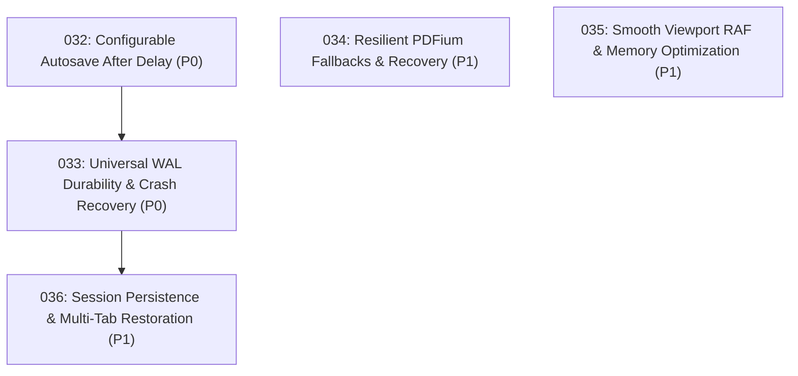

# Implementation Plans

Generated by the `/improve` skill on 2026-08-18 for **Inkwell**. Execute in the order below unless dependencies say otherwise. Each executor: read the plan fully before starting, honor its STOP conditions, and update your row when done.

## Execution order & status

| Plan | Title | Priority | Effort | Depends on | Status |
|---|---|---|---|---|---|
| 001 | PDF Import Robustness & Universal PDFium Fallback | P1 | S | — | DONE |
| 002 | PDFium Tile Rasterizer Aspect & Bounds Fix | P1 | S | 001 | DONE |
| 003 | Dual-Pane Split View Architecture & Navigation | P1 | M | 002 | DONE |
| 004 | Tauri v2 Dialog Plugin Binding & File Loading Wiring | P2 | S | 001 | DONE |
| 005 | Deep PDFium DLL Search, PDF Normalised Save, and Right Panel UI Toggle | P1 | S | 001 | DONE |
| 006 | PDFium Singleton Cache + Visible Tile Error UI | P1 | S | 001,002 | DONE |
| 007 | Performance, Page Positioning, Independent Split Zoom, & PDF Y-Axis Save Coordinate Fix | P0 | M | 006 | DONE |
| 008 | Fix PDF Page Positioning & Aspect Ratio Distortion | P0 | S | — | DONE |
| 009 | Polished Split View with Independent Zoom, Page Selectors, & Divider | P1 | M | 008 | DONE |
| 010 | Rendering Performance — Tile Grid, Debouncing, & Memory Budget | P2 | M | 008 | DONE |
| 011 | Codex Handoff — Rotation/Height, Highlighter Transparency, Sidebar Collapse, & Zoom Controls | P0 | M | 008,009 | DONE |
| 012 | Sidebar Collapse CSS Fix & Dedicated Zoom Toolbar Buttons | P1 | S | — | DONE |
| 013 | PDFium Document Handle Caching & Zero-Copy RGBA Tile Transfer | P0 | M | — | DONE |
| 014 | Stroke Canvas RAF Debouncing, Layout Cache, & Eraser Bug Fix | P0 | S | 013 | DONE |
| 015 | UI/UX Pro-Max Touch Targets, Focus Rings, Tool Cursors, & Glassmorphic Toasts | P1 | S | — | DONE |
| 016 | Stroke Path2D Object Caching & Non-Blocking Async WAL Disk Sync | P1 | M | 014 | DONE |
| 017 | WAL Crash Recovery Toast, Laser Pointer Decay, & Root AGENTS.md | P2 | S | 015 | DONE |
| 018 | Header Open PDF Button, File Drag-and-Drop, & Canvas Welcome Dropzone | P0 | S | — | DONE |
| 019 | Fix Native File Dialog Deadlock & File Input DOM Placement | P0 | S | 018 | DONE |
| 020 | Zero-Latency Inking Pipeline, DOM Layout Thrashing Elimination, and Path2D Retention | P0 | S | — | DONE |
| 021 | PDFium Document Handle Caching, Sub-Rectangle Rasterization, and Thread Pool Offloading | P0 | M | — | DONE |
| 022 | Multi-Document Tab Backend Synchronization and Full Mutation State Durability | P0 | M | — | DONE |
| 023 | Security Hardening: UTF-8 Search Slicing, DLL Hijacking Prevention, CSP, and Input Validation | P0 | S | — | DONE |
| 024 | Touch & Stylus Ergonomics: Palm Rejection, Pinch-to-Zoom, Drawer Animations, and Chisel Geometry | P1 | M | 020 | DONE |
| 025 | Spatial Indexing for Eraser/Lasso Hit-Testing and Thumbnail DOM Virtualization | P1 | M | 020 | DONE |
| 026 | Accessibility Hardening: 44px Touch Targets, Modal Focus Traps, and State Indicators | P1 | S | — | DONE |
| 027 | Page Lifecycle Repair, Viewport Layout Synchronization & Customizable Page Insertion Dialog | P0 | S | — | DONE |
| 028 | Multi-Document Tab Backend Session Synchronization & Backend State Isolation | P0 | M | 027 | DONE |
| 029 | Frictionless Viewport Physics: RAF Wheel Decoupling, Progressive LOD-0 Underlay, and Virtualized Thumbnails | P1 | S | 027 | DONE |
| 030 | Page Management Suite & Paper Background Templates | P1 | M | 027 | DONE |
| 031 | Precision Navigation Suite: Direct Go-to-Page Modal (Ctrl+G), Stylus Barrel Actions & Comprehensive Shortcuts Matrix | P1 | S | 027 | DONE |
| **032** | **Configurable Autosave After Delay & Non-Blocking Dirty State Engine** | **P0** | **M** | **028** | **DONE** |
| **033** | **Universal WAL Durability & Comprehensive Crash Recovery for All Mutations (Images, Text, Layout)** | **P0** | **M** | **032** | **DONE** |
| **034** | **Resilient PDFium Fallbacks, Corrupt Document Recovery & Graceful Degradation** | **P1** | **S** | **—** | **DONE** |
| **035** | **Smooth Viewport RAF Pipeline & Memory Footprint Optimization (Inertial Momentum, Texture Bounding)** | **P1** | **M** | **—** | **DONE** |
| **036** | **Session State Persistence & Multi-Tab Crash Restoration (LocalStorage Session Index, Auto-Reload)** | **P1** | **S** | **033** | **DONE** |

Status values: `TODO` | `IN PROGRESS` | `DONE` | `BLOCKED (with one-line reason)` | `REJECTED (with one-line rationale)`

## Dependency & Priority Graph

## Recommended Execution Sequence

1. **Wave 1 (Configurable Autosave Engine — P0)**: Execute Plan `032` to implement debounced after-delay autosaving (Off, 500ms, 1s, 2s, 5s, 10s, 30s), accurate `isDirty` state tracking across all edit tools, and subtle non-blocking save status badges in the top bar.
2. **Wave 2 (Universal Crash Recovery & WAL Hardening — P0)**: Execute Plan `033` to expand `WalEntry` to cover image insertions/moves, text notes, page deletions, reordering, and rotations, guaranteeing zero data loss on unexpected termination.
3. **Wave 3 (Resilient Fallbacks & PDFium Degradation — P1)**: Execute Plan `034` to provide graceful vector paper placeholders, diagnostic recovery banners, and dynamic DLL reload if PDFium dynamic library is missing or damaged.
4. **Wave 4 (Smooth Viewport Motion & Texture Pool — P1)**: Execute Plan `035` to add kinetic inertia physics to scrolling/zooming and bound GPU texture memory via proactive `ImageBitmap.close()` cleanup.
5. **Wave 5 (Multi-Tab Session Restoration — P1)**: Execute Plan `036` to store active tab sessions in local storage so that reopening Inkwell after a restart or crash instantly re-hydrates all previously open tabs and replays their WAL journals.

## Findings considered and rejected

- `Micro-optimization of stroke point smoothing`: Not worth doing because current One-Euro filter in `ink.rs` / `ink.js` already runs in sub-millisecond time.
- `Complete rewrite of PDF parsing in JS`: Not worth doing because Rust `pdfium-render` binding is native, faster, and already handles PDF rendering.
- `Switch to Rust-side TileCache for frontend`: Not worth doing now — JS-side tile grid with zero-copy RGBA transfer provides equivalent performance with minimal IPC changes.
