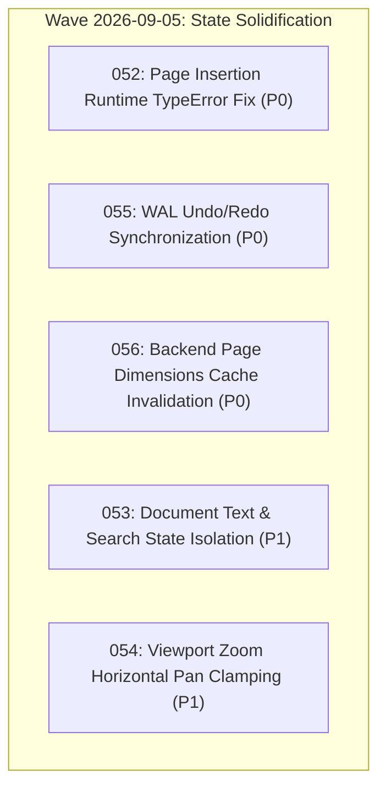

# Implementation Plans

Generated by the `/improve` skill on 2026-08-21 for **Inkwell**. Execute in the order below unless dependencies say otherwise. Each executor: read the plan fully before starting, honor its STOP conditions, and update your row when done.

## Execution order & status

| Plan | Title | Priority | Effort | Depends on | Status |
|---|---|---|---|---|---|
| 001 | PDF Import Robustness & Universal PDFium Fallback | P1 | S | — | DONE |
| 002 | PDFium Tile Rasterizer Aspect & Bounds Fix | P1 | S | 001 | DONE |
| 003 | Dual-Pane Split View Architecture & Navigation | P1 | M | 002 | DONE |
| 004 | Tauri v2 Dialog Plugin Binding & File Loading Wiring | P2 | S | 001 | DONE |
| 005 | Deep PDFium DLL Search, PDF Normalised Save, and Right Panel UI Toggle | P1 | S | 001 | DONE |
| 006 | PDFium Singleton Cache + Visible Tile Error UI | P1 | S | 001,002 | DONE |
| 007 | Performance, Page Positioning, Independent Split Zoom, & PDF Y-Axis Save Coordinate Fix | P0 | M | 006 | DONE |
| 008 | Fix PDF Page Positioning & Aspect Ratio Distortion | P0 | S | — | DONE |
| 009 | Polished Split View with Independent Zoom, Page Selectors, & Divider | P1 | M | 008 | DONE |
| 010 | Rendering Performance — Tile Grid, Debouncing, & Memory Budget | P2 | M | 008 | DONE |
| 011 | Codex Handoff — Rotation/Height, Highlighter Transparency, Sidebar Collapse, & Zoom Controls | P0 | M | 008,009 | DONE |
| 012 | Sidebar Collapse CSS Fix & Dedicated Zoom Toolbar Buttons | P1 | S | — | DONE |
| 013 | PDFium Document Handle Caching & Zero-Copy RGBA Tile Transfer | P0 | M | — | DONE |
| 014 | Stroke Canvas RAF Debouncing, Layout Cache, & Eraser Bug Fix | P0 | S | 013 | DONE |
| 015 | UI/UX Pro-Max Touch Targets, Focus Rings, Tool Cursors, & Glassmorphic Toasts | P1 | S | — | DONE |
| 016 | Stroke Path2D Object Caching & Non-Blocking Async WAL Disk Sync | P1 | M | 014 | DONE |
| 017 | WAL Crash Recovery Toast, Laser Pointer Decay, & Root AGENTS.md | P2 | S | 015 | DONE |
| 018 | Header Open PDF Button, File Drag-and-Drop, & Canvas Welcome Dropzone | P0 | S | — | DONE |
| 019 | Fix Native File Dialog Deadlock & File Input DOM Placement | P0 | S | 018 | DONE |
| 020 | Zero-Latency Inking Pipeline, DOM Layout Thrashing Elimination, and Path2D Retention | P0 | S | — | DONE |
| 021 | PDFium Document Handle Caching, Sub-Rectangle Rasterization, and Thread Pool Offloading | P0 | M | — | DONE |
| 022 | Multi-Document Tab Backend Synchronization and Full Mutation State Durability | P0 | M | — | DONE |
| 023 | Security Hardening: UTF-8 Search Slicing, DLL Hijacking Prevention, CSP, and Input Validation | P0 | S | — | DONE |
| 024 | Touch & Stylus Ergonomics: Palm Rejection, Pinch-to-Zoom, Drawer Animations, and Chisel Geometry | P1 | M | 020 | DONE |
| 025 | Spatial Indexing for Eraser/Lasso Hit-Testing and Thumbnail DOM Virtualization | P1 | M | 020 | DONE |
| 026 | Accessibility Hardening: 44px Touch Targets, Modal Focus Traps, and State Indicators | P1 | S | — | DONE |
| 027 | Page Lifecycle Repair, Viewport Layout Synchronization & Customizable Page Insertion Dialog | P0 | S | — | DONE |
| 028 | Multi-Document Tab Backend Session Synchronization & Backend State Isolation | P0 | M | 027 | DONE |
| 029 | Frictionless Viewport Physics: RAF Wheel Decoupling, Progressive LOD-0 Underlay, and Virtualized Thumbnails | P1 | S | 027 | DONE |
| 030 | Page Management Suite & Paper Background Templates | P1 | M | 027 | DONE |
| 031 | Precision Navigation Suite: Direct Go-to-Page Modal (Ctrl+G), Stylus Barrel Actions & Comprehensive Shortcuts Matrix | P1 | S | 027 | DONE |
| 032 | Configurable Autosave After Delay & Non-Blocking Dirty State Engine | P0 | M | 028 | DONE |
| 033 | Universal WAL Durability & Comprehensive Crash Recovery for All Mutations (Images, Text, Layout) | P0 | M | 032 | DONE |
| 034 | Resilient PDFium Fallbacks, Corrupt Document Recovery & Graceful Degradation | P1 | S | — | DONE |
| 035 | Smooth Viewport RAF Pipeline & Memory Footprint Optimization (Inertial Momentum, Texture Bounding) | P1 | M | — | DONE |
| 036 | Session State Persistence & Multi-Tab Crash Restoration (LocalStorage Session Index, Auto-Reload) | P1 | S | 033 | DONE |
| **037** | **High-Precision Character-Level Text Selection Engine & Complete Overhaul** | **P0** | **M** | **—** | **DONE** |
| **038** | **Complete Modular ES Frontend Cutover, Feature Porting & `app.js` Decommissioning** | **P0** | **M** | **037** | **DONE** |
| **039** | **Rust Core & Backend Compiler Warning Elimination and Cross-Platform Cleanup** | **P1** | **S** | **—** | **DONE** |
| **040** | **Frontend Modular Test Suite & E2E Verification for `inkwell-app`** | **P1** | **S** | **038** | **DONE** |
| 041 | Save Pipeline Integrity — Stroke Identity, Full-State Sync & IPC Arg Contracts | P0 | M | — | DONE |
| 042 | Zoom Controls Repair — Methods, Presets, Live Display & Shortcuts | P0 | S | — | DONE |
| 043 | Text Toolchain Restoration — Selection Activation, Copy Path, Sticky Notes & Search Drawer | P0 | M | — | DONE |
| 044 | Persist Sticky Notes as Real PDF Text Objects | P1 | M | 041 | DONE |
| 045 | Real Verification Baseline — Honest Smoke Suite, Dead E2E Retirement, CI & Docs Truthing | P1 | M | 041,042,043 | DONE |
| 046 | Interactive Performance Wave — Raw Tile Bytes, Pointer-Path Throttling, Redraw Culling | P1 | M | (after 045) | DONE |
| 047 | Error Surface & Session-Lifecycle Honesty — No Swallowed Failures, Working Quit-Save, Dead UI Triage | P2 | S–M | 041,043 | DONE |
| 048 | Viewport Engine Geometry & Tile Rasterization Scale Clamping | P0 | S–M | — | DONE |
| 049 | UI Modal Action Wiring, Focus Trapping & Accessibility Polish | P1 | M | — | DONE |
| 050 | Inking Pipeline Streamlining, Spatial Eraser & Lasso Matrix Transformations | P1 | M | — | DONE |
| 051 | PDF Annotation Integrity, Undo/Redo IPC Synchronization & Durability Hardening | P0 | M | — | DONE |
| 052 | Page Insertion Runtime TypeError Fix | P0 | S | — | DONE |
| 053 | Document Text Layer & Search State Isolation on Open | P1 | S | — | DONE |
| 054 | Viewport Zoom & Pinch-to-Zoom Horizontal Pan Clamping | P1 | S | — | DONE |
| 055 | WAL Undo/Redo Mutation Synchronization for Images, Text & Batch Deletions | P0 | M | — | DONE |
| 056 | Backend Page Dimensions Cache Invalidation on Page Mutations | P0 | S | — | DONE |
| 057 | Windows WebView2 DirectManipulation Touchpad Pinch-to-Zoom | P1 | M | — | UNFIXED |

Status values: `TODO` | `IN PROGRESS` | `DONE` | `UNFIXED` | `BLOCKED (with one-line reason)` | `REJECTED (with one-line rationale)`

> **Note on Wave 2026-09-05 (Plans 052–056: State Solidification)**:
> Generated by `/improve` audit on 2026-09-05 against HEAD `a3f3e8d`.
> Resolves runtime crash on page insertion (052), text cache cross-document bleeding (053),
> horizontal zoom drift / unclamped panning (054), WAL undo/redo desync for images and text (055),
> and stale backend page dimensions caching across page mutations (056).

> **Note on Plan 057 (Windows WebView2 DirectManipulation Touchpad Pinch-to-Zoom)**:
> Marked `UNFIXED` / `UNSOLVED` per manual testing on Windows hardware touchpads.
> In Tauri v2 on Windows, DirectManipulation captures precision touchpad pinch gestures before DOM
> wheel/pointer events can be dispatched. Requires native host WebView2 configuration or OS hook.

## Dependency & Priority Graph

## Recommended Execution Sequence

**Current wave (2026-09-05 audit — plans 052–056: State Solidification):**

1. **Wave 1 — High-Priority Runtime & Durability Bug Fixes (P0)**:
   - **Plan 052** (Page Insertion Runtime TypeError Fix): Fixes `navigation.renderThumbnails` call in `main.js:691` to `drawers.renderThumbnails()`, restoring thumbnail update and canvas redraw.
   - **Plan 055** (WAL Undo/Redo Mutation Synchronization for Images, Text & Batch Deletions): Dispatches WAL journal IPC for image, text, and batch undo/redo events in `main.js:1300-1337`.
   - **Plan 056** (Backend Page Dimensions Cache Invalidation on Page Mutations): Clears `page_dimensions` cache on page insertion, deletion, duplication, rotation, and reordering in `commands.rs`.
2. **Wave 2 — Viewport & State Boundary Hardening (P1)**:
   - **Plan 053** (Document Text Layer & Search State Isolation on Open): Clears cached `pageTextData`, `pageTextSpans`, `textSelection`, and `searchResults` in `setDocument`, and shifts text cache on page insertion.
   - **Plan 054** (Viewport Zoom & Pinch-to-Zoom Horizontal Pan Clamping): Clamps `panX` with `clampPanX()` in all `setZoom` and pinch-to-zoom handlers in `viewport.js`.

**Historical waves (plans 001–051)**: see git history; all marked DONE except 037 accuracy scope.

## Findings considered and rejected

- `Micro-optimization of stroke point smoothing`: Not worth doing because current One-Euro filter in `ink.rs` / `ink.js` already runs in sub-millisecond time.
- `Complete rewrite of PDF parsing in JS`: Not worth doing because Rust `pdfium-render` binding is native, faster, and already handles PDF rendering.
- `Switch to Rust-side TileCache for frontend`: Not worth doing now — JS-side tile grid with zero-copy RGBA transfer provides equivalent performance with minimal IPC changes.
- `Backend pdfium worker-thread + per-bucket bitmap cache (cold tile miss re-parses PDF under global mutex, commands.rs:533-557)`: Real finding (PERF-02), deliberately deferred from Plan 046 — needs a dedicated design for pdfium-render's non-Send `Document`; file as follow-up if pan latency persists after 046.
- `Security hardening parity for open_pdf (no extension/size validation on open path while save_pdf validates)`: LOW risk for a desktop app where the user picks files via native dialog; noted here so it is not re-audited; revisit only if the webview ever renders untrusted content.
- `Predictable temp filename in open_pdf_bytes (commands.rs:419-427)`: %TEMP% is per-user on Windows; symlink/pre-creation risk assessed negligible for this app class.
- `Complete virtual DOM framework rewrite`: Rejected because InkWell's lightweight vanilla ES modular architecture provides lower overhead and better inking response than virtual DOM libraries.
