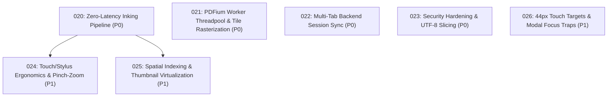

# Implementation Plans

Generated by the `/improve` skill on 2026-08-14 for **Inkwell**. Execute in the order below unless dependencies say otherwise. Each executor: read the plan fully before starting, honor its STOP conditions, and update your row when done.

## Execution order & status

| Plan | Title | Priority | Effort | Depends on | Status |
|---|---|---|---|---|---|
| 001 | PDF Import Robustness & Universal PDFium Fallback | P1 | S | — | DONE |
| 002 | PDFium Tile Rasterizer Aspect & Bounds Fix | P1 | S | 001 | DONE |
| 003 | Dual-Pane Split View Architecture & Navigation | P1 | M | 002 | DONE |
| 004 | Tauri v2 Dialog Plugin Binding & File Loading Wiring | P2 | S | 001 | DONE |
| 005 | Deep PDFium DLL Search, PDF Normalised Save, and Right Panel UI Toggle | P1 | S | 001 | DONE |
| 006 | PDFium Singleton Cache + Visible Tile Error UI | P1 | S | 001,002 | DONE |
| 007 | Performance, Page Positioning, Independent Split Zoom, & PDF Y-Axis Save Coordinate Fix | P0 | M | 006 | DONE |
| 008 | Fix PDF Page Positioning & Aspect Ratio Distortion | P0 | S | — | DONE |
| 009 | Polished Split View with Independent Zoom, Page Selectors, & Divider | P1 | M | 008 | DONE |
| 010 | Rendering Performance — Tile Grid, Debouncing, & Memory Budget | P2 | M | 008 | DONE |
| 011 | Codex Handoff — Rotation/Height, Highlighter Transparency, Sidebar Collapse, & Zoom Controls | P0 | M | 008,009 | DONE |
| 012 | Sidebar Collapse CSS Fix & Dedicated Zoom Toolbar Buttons | P1 | S | — | DONE |
| 013 | PDFium Document Handle Caching & Zero-Copy RGBA Tile Transfer | P0 | M | — | DONE |
| 014 | Stroke Canvas RAF Debouncing, Layout Cache, & Eraser Bug Fix | P0 | S | 013 | DONE |
| 015 | UI/UX Pro-Max Touch Targets, Focus Rings, Tool Cursors, & Glassmorphic Toasts | P1 | S | — | DONE |
| 016 | Stroke Path2D Object Caching & Non-Blocking Async WAL Disk Sync | P1 | M | 014 | DONE |
| 017 | WAL Crash Recovery Toast, Laser Pointer Decay, & Root AGENTS.md | P2 | S | 015 | DONE |
| 018 | Header Open PDF Button, File Drag-and-Drop, & Canvas Welcome Dropzone | P0 | S | — | DONE |
| 019 | Fix Native File Dialog Deadlock & File Input DOM Placement | P0 | S | 018 | DONE |
| **020** | **Zero-Latency Inking Pipeline, DOM Layout Thrashing Elimination, and Path2D Retention** | **P0** | **S** | **—** | **DONE** |
| **021** | **PDFium Document Handle Caching, Sub-Rectangle Rasterization, and Thread Pool Offloading** | **P0** | **M** | **—** | **DONE** |
| **022** | **Multi-Document Tab Backend Synchronization and Full Mutation State Durability** | **P0** | **M** | **—** | **DONE** |
| **023** | **Security Hardening: UTF-8 Search Slicing, DLL Hijacking Prevention, CSP, and Input Validation** | **P0** | **S** | **—** | **DONE** |
| **024** | **Touch & Stylus Ergonomics: Palm Rejection, Pinch-to-Zoom, Drawer Animations, and Chisel Geometry** | **P1** | **M** | **020** | **DONE** |
| **025** | **Spatial Indexing for Eraser/Lasso Hit-Testing and Thumbnail DOM Virtualization** | **P1** | **M** | **020** | **DONE** |
| **026** | **Accessibility Hardening: 44px Touch Targets, Modal Focus Traps, and State Indicators** | **P1** | **S** | **—** | **DONE** |

Status values: `TODO` | `IN PROGRESS` | `DONE` | `BLOCKED (with one-line reason)` | `REJECTED (with one-line rationale)`

## Dependency & Priority Graph

## Recommended Execution Sequence

1. **Wave 1 (Core Inking & PDF Engine Performance — P0)**: Execute Plan `020` and Plan `021` to eliminate layout thrashing, DOM mutations in the inking loop, and offload PDFium rasterization to worker threads.
2. **Wave 2 (Data Integrity & Security Hardening — P0)**: Execute Plan `022` and Plan `023` to eliminate multi-tab data clobbering, sync undo/redo with WAL, and eliminate UTF-8 search slicing panics and DLL hijacking paths.
3. **Wave 3 (Touch/Stylus Interaction & Motion Physics — P1)**: Execute Plan `024` to add palm rejection, two-finger pinch-to-zoom, fluid drawer slide animations, and accurate chisel highlighter geometry.
4. **Wave 4 (Spatial Indexing & Accessibility — P1)**: Execute Plan `025` and Plan `026` to accelerate eraser/lasso hit-testing via AABBs, virtualize the thumbnail drawer, expand touch targets to 44px, and trap modal focus.

## Findings considered and rejected

- `Micro-optimization of stroke point smoothing`: Not worth doing because current One-Euro filter in `ink.rs` / `ink.js` already runs in sub-millisecond time.
- `Complete rewrite of PDF parsing in JS`: Not worth doing because Rust `pdfium-render` binding is native, faster, and already handles PDF rendering.
- `Switch to Rust-side TileCache for frontend`: Not worth doing now — JS-side tile grid in Plan 013 with zero-copy RGBA transfer provides equivalent performance with minimal IPC changes.
